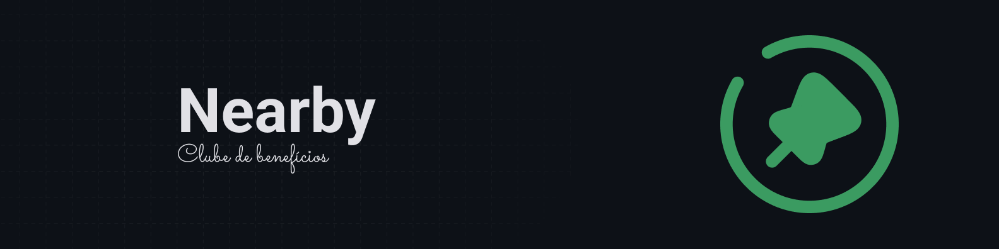
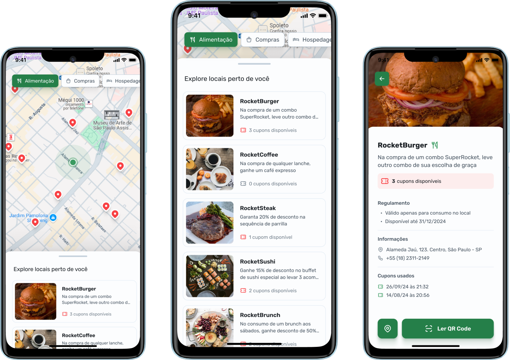

  

  
  <a aria-label="Completed" href="https://rocketseat.com.br/">
    </img>

## :speech_balloon: Visão Geral

Um aplicativo de clube de benefícios, semelhante ao iFood, onde você pode encontrar estabelecimentos parceiros próximos, ativar cupons e aproveitar vantagens exclusivas.

## :camera: Preview

  

### :sparkles: Funcionalidades

- Consumo de API para busca de estabelecimentos
- Uso do Google Maps para localização e visualização dos estabelecimentos próximos
- Leitura de QR Code para validação de cupom de desconto

A seguir, alguns dos aprendizados/conceitos postos em prática durante o desenvolvimento:

- Funtamentos da linguagem Kotlin para desenvolvimento nativo Android
- Fundamentos do Jetpack Compose para criação de componentes de interface
- Uso da biblioteca [Coil](https://coil-kt.github.io/coil/) para carregamento performático de imagens
- Serialização de dados
  

## :rocket: Tecnologias Utilizadas

  
  
  
 

 

  Feito com :purple_heart:

